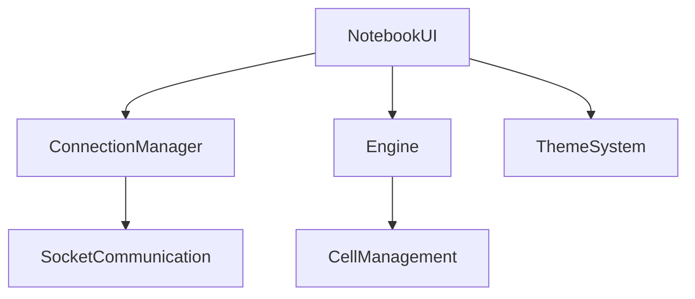

Here's a comprehensive `README.md` for your `notebook_ui.py` project:

```markdown
# Notebook UI Application 📓


A Google Colab-like notebook interface with server connection capabilities, built with Python and Tkinter.

## Features ✨

### 🖥️ Core Functionality
- Code and Markdown cell management
- Cell execution with output display
- Notebook file operations (New/Open/Save)
- Download as `.ipynb` (Jupyter Notebook format)

### 🌗 UI Features
- Toggleable light/dark themes
- Custom green-text dark mode
- Scrollable notebook interface
- Toolbar with quick-access buttons

### 🔌 Server Integration
- Multiple server connection management
- Socket-based communication
- Authentication system (username/password)
- Active connection tracking

### 🛠️ Developer Tools
- Runtime management (restart/change type)
- Table of contents generator
- Output clearing functionality

## Installation ⚙️

### Requirements
- Python 3.8+
- Tkinter (usually included with Python)

```bash
# Clone repository (if applicable)
git clone https://github.com/yourusername/notebook-ui.git
cd notebook-ui

# Install dependencies
pip install -r requirements.txt
```

## Usage 🚀

```python
python notebook_ui.py
```

### Main Components
1. **Menu Bar** - Full-featured menu system
2. **Toolbar** - Quick-access buttons
3. **Connection Manager** - Right-click to add/remove servers
4. **Notebook Area** - Interactive cells with run buttons

### Keyboard Shortcuts
| Action | Shortcut |
|--------|----------|
| New Notebook | Ctrl+N |
| Save Notebook | Ctrl+S |
| Run Cell | Shift+Enter |
| Toggle Theme | Ctrl+T |

## Code Structure 🏗️



### Key Classes
- `ConnectionManager`: Handles server connections
- `NotebookUI`: Main application window
- `Engine`: Backend cell processor (simulated)

## Customization 🎨

### Theme Configuration
Edit the `apply_theme()` method to change colors:
```python
"dark": {
    "bg": "#000000",        # Background
    "fg": "#00ff00",        # Text color (green)
    "editor_bg": "#121212", # Code editor
    # ... more colors
}
```

### Adding New Features
1. Implement new cell types by extending:
   - `create_cell_ui()`
   - `run_specific_cell()`
2. Add menu items in `setup_menu()`

## Troubleshooting ⚠️

### Common Issues
1. **Connection Errors**:
   - Verify server IP/port
   - Check firewall settings

2. **UI Glitches**:
   - Use `self.update()` after theme changes
   - Ensure all widgets have proper `pack()`/`grid()`

3. **Performance**:
   - Limit cell output size
   - Use threading for long operations

## License 📄
MIT License - See [LICENSE](LICENSE) for details

---

**Tip**: For production use, consider replacing the simulated engine with a real Python execution backend like Jupyter kernel integration.
```

This README includes:
1. Badges for quick tech overview
2. Visual hierarchy of features
3. Clear installation/usage instructions
4. Architecture diagram
5. Theme customization guide
6. Troubleshooting section
7. Future improvement suggestions

Would you like me to add any specific details about:
- The authentication protocol?
- Performance benchmarks?
- Deployment options?
